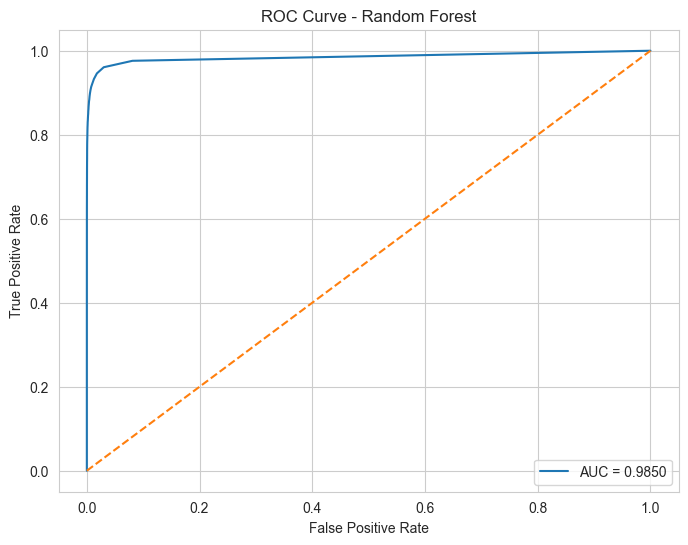
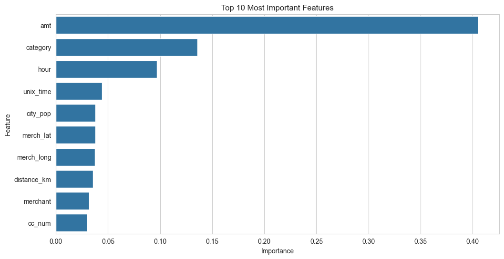
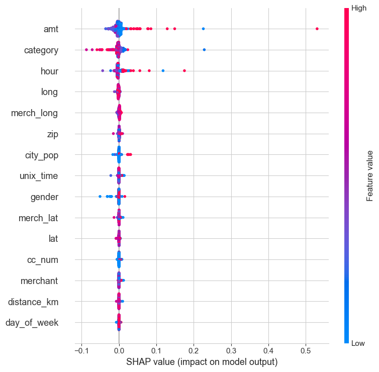

# Credit Card Fraud Detection System

An end-to-end machine learning project focused on detecting fraudulent financial transactions using behavioral analysis, feature engineering, explainable AI, and threshold optimization.

---

## Project Overview

This project explores real-world fraud detection challenges using a large-scale transaction dataset containing over 1.2 million financial transactions.

The system combines:

* Exploratory Data Analysis (EDA)
* Feature Engineering
* Random Forest Classification
* Threshold Optimization
* Explainable AI using SHAP
* Fraud Behavior Analysis

The goal was not only to build a high-performing model, but also to understand the behavioral and temporal patterns behind fraudulent transactions.

---

## Key Features

* Large-scale fraud detection pipeline
* Geospatial feature engineering using Haversine distance
* Temporal fraud analysis (hourly fraud activity)
* Imbalanced dataset handling
* Threshold tuning for improved fraud recall
* Model explainability using SHAP
* Professional visualizations and evaluation metrics

---

## Dataset

The dataset contains anonymized financial transactions including:

* Transaction amount
* Merchant category
* Geographic information
* Transaction timestamps
* Customer demographic information
* Fraud labels

### Dataset Size

| Dataset       | Rows      |
| ------------- | --------- |
| Training Data | 1,296,675 |
| Testing Data  | 555,719   |

---

## Exploratory Data Analysis

The project includes extensive EDA to understand fraud behavior patterns.

### Fraud Distribution

* Fraudulent transactions represented only ~0.58% of the dataset
* Severe class imbalance required careful evaluation beyond accuracy

### Temporal Fraud Patterns

Fraud activity showed strong clustering during late-night hours (22:00–03:00), suggesting behavioral fraud trends rather than random activity.

### Transaction Amount Analysis

Fraudulent transactions generally exhibited:

* Higher transaction amounts
* Greater variability
* More extreme outliers

---

## Feature Engineering

Several custom features were engineered to improve model performance.

### Geographic Distance Feature

A custom `distance_km` feature was created using the Haversine formula to calculate the distance between:

* Cardholder location
* Merchant location

This helped capture anomalous geographic transaction behavior.

### Time-Based Features

Extracted:

* Transaction hour
* Day of week

These features significantly improved fraud pattern detection.

---

## Machine Learning Model

### Model Used

* Random Forest Classifier

### Why Random Forest?

Random Forest was selected because it:

* Handles non-linear fraud patterns well
* Performs effectively on mixed feature types
* Is robust against noisy transactional data
* Provides feature importance analysis

---

## Model Performance

### Baseline Performance

| Metric    | Fraud Class |
| --------- | ----------- |
| Precision | 0.95        |
| Recall    | 0.68        |
| F1 Score  | 0.79        |
| ROC-AUC   | 0.985       |

### Threshold Optimization

The default classification threshold was lowered from `0.50` to `0.30` to improve fraud detection recall.

| Metric    | Before | After Threshold Tuning |
| --------- | ------ | ---------------------- |
| Precision | 0.95   | 0.86                   |
| Recall    | 0.68   | 0.79                   |
| F1 Score  | 0.79   | 0.82                   |

This tradeoff improved fraud capture significantly while maintaining strong precision.

---

## Visualizations

### ROC Curve



---

### Feature Importance



---

### SHAP Explainability



---

## SHAP Explainability

SHAP (SHapley Additive exPlanations) was used to interpret model predictions.

Key insights included:

* High transaction amounts strongly increased fraud probability
* Late-night transactions contributed heavily toward fraud predictions
* Merchant category had strong directional influence
* Engineered features contributed meaningfully in combination

This improved the interpretability and transparency of the fraud detection pipeline.

---

## Tech Stack

### Languages & Libraries

* Python
* Pandas
* NumPy
* Scikit-learn
* Matplotlib
* Seaborn
* SHAP
* Jupyter Notebook

---

## Project Structure

```text
credit-card-fraud-detection/
│
├── notebooks/
│   └── fraud_detection.ipynb
│
├── images/
│   ├── roc_curve.png
│   ├── feature_importance.png
│   └── shap_summary.png
│
├── data/
├── models/
├── outputs/
│
├── README.md
└── requirements.txt
```

---

## Future Improvements

Potential future enhancements include:

* XGBoost / LightGBM experimentation
* Deep learning approaches
* Real-time fraud detection APIs
* Hyperparameter tuning
* Streamlit dashboard deployment
* Advanced anomaly detection techniques
* Cost-sensitive learning strategies

---

## Author

Soumyadeep Roy

MSc Advanced Computer Science — University of Leeds
